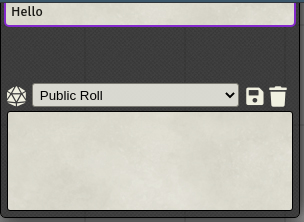

# Cautious Gamemaster's Pack

Offers various simple handy options.

Please note that v0.2.0 was called "Cautious Gamemaster's Pack 2", but since ownership of the original Foundry package has been transferred to me this has now been renamed back to "Cautious Gamemaster's Pack".  ***If you installed v0.2.0 and then upgrade to v0.2.1 you will find you have both "Cautious Gamemaster's Pack" and "Cautious Gamemaster's Pack 2" installed.  You will have to manually remove "Cautious Gamemaster's Pack 2".***

## Settings

* Disable GM from speaking as PC tokens - If the GM has a PC token selected and types a message in the chat box, this will prevent the message appearing as if it came from that PC.  It will be sent as an out-of-character message instead.
* Blind rolls made by hidden tokens - This makes all rolls made by hidden tokens into blind rolls.
* Disable Chat Recall - Disable using up/down arrow keys to recall previous chats so that they can be used to move the text cursor.

## Typing Notifications

* Notify whether the other players are typing chat messages (Toggle)

## Additional Chat Commands

* Additional chat commands - `/desc` for description and `/as` for in-charactor without tokens

---

Version 2 is forked from [ShoyuVanilla's Cautious Gamemaster's Pack](https://github.com/ShoyuVanilla/FoundryVTT-CGMP) and contains a number of enhancements...

1. Added support for FoundryVTT v0.8.x
2. When "Blind chats out of hidden tokens" is enabled, and the GM types a message while a hidden token is selected, this will be sent as a **visible** out-of-character message.  This assumes that the GM wants the message to appear, but forgot to deselect the token.  All rolls etc done by that token will still be hidden.
3. Updated to use [libWrapper](https://foundryvtt.com/packages/lib-wrapper/).
4. Added compatibility with the "[Tabbed Chatlog](https://foundryvtt.com/packages/tabbed-chatlog/)" module.

