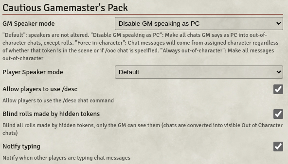

# Cautious Gamemaster's Pack

Offers various simple handy options.

* Disable GM from speaking as PC tokens (Toggle)
* Blind chats and rolls made by hidden tokens (Toggle)
* Disable using up/down arrow keys to recall previous chats so that they can be used to move the text cursor (Toggle)

* Notify wether the other players are typing chat messages (Toggle)

* Additional chat commands; /desc for description and /as for In Charactor without tokens